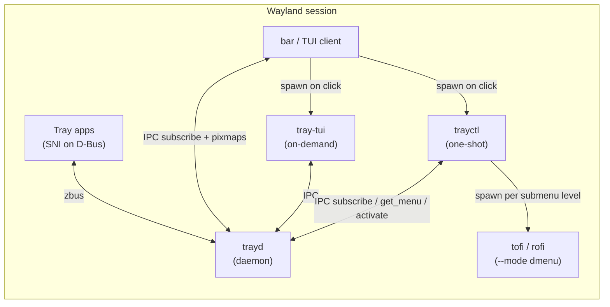

# trayd

Minimal Wayland-session system tray daemon (`zbus`) with a documented IPC socket for bars and other clients.

## Workspace

| Crate      | Role                                                           |
| ---------- | -------------------------------------------------------------- |
| `libtrayd` | D-Bus SNI host + DBusMenu client (library, used by trayd only) |
| `trayd`    | Persistent daemon — D-Bus host + Unix-socket IPC server        |
| `trayctl`  | One-shot menu orchestrator (IPC client + dmenu bridge)         |
| `tray-tui` | Terminal UI client (IPC socket only)                           |

See [`docs/IPC.md`](docs/IPC.md) for the wire protocol.

---

## Architecture



| Component    | Role                                     | Lifecycle              | Spawns?                      |
| ------------ | ---------------------------------------- | ---------------------- | ---------------------------- |
| **trayd**    | SNI watcher, icon/menu cache, IPC server | Persistent daemon      | **Never**                    |
| **libtrayd** | D-Bus + in-memory `TrayHost` (library)   | Linked only by `trayd` | —                            |
| **trayctl**  | IPC → subscribe stream / dmenu bridge    | One-shot per click     | dmenu tool per submenu level |
| **tray-tui** | ratatui terminal UI over IPC             | On-demand              | **Never**                    |
| **client**   | Any consumer of the IPC socket           | Any                    | User-defined                 |

---

## Build

```sh
cargo build --workspace
```

---

## Running

### 1. Start the daemon

```sh
trayd
# or explicitly:
trayd run
```

By default the daemon listens on `$XDG_RUNTIME_DIR/trayd.sock`.
To use a custom socket or log level, copy `examples/trayd.toml` to
`$XDG_CONFIG_HOME/trayd/trayd.toml` and edit it.

Health-check while the daemon is running:

```sh
trayd ping
```

### 2. List registered tray items

```sh
trayctl items
```

Output is a JSON array of `MinimalTrayItem` objects:

```json
[
  {
    "app_id": "org.freedesktop.NetworkManager.applet",
    "title": "Network",
    "status": "Active",
    "icon_handle": "nm-device-wireless"
  }
]
```

### 3. Stream tray state changes

```sh
trayctl subscribe
```

A built-in CLI alternative to subscribing via the socket directly. Sends a `subscribe` request
and streams tray-state events as NDJSON to stdout — one line per update, each line being a JSON
array of `MinimalTrayItem` objects. Exits cleanly when the daemon closes the connection.

```json
[{"app_id":"org.freedesktop.NetworkManager.applet","title":"Network","status":"Active","icon_handle":"nm-device-wireless"}]
[{"app_id":"org.freedesktop.NetworkManager.applet","title":"Network","status":"NeedsAttention","icon_handle":"nm-device-wireless"}]
```

Example — react to every state change in a shell script:

```sh
trayctl subscribe | while IFS= read -r line; do
    echo "tray updated: $line"
done
```

For custom clients that speak the IPC protocol directly, the raw `subscribe` command on the socket
remains fully supported — see [`docs/IPC.md`](docs/IPC.md).

### 4. Open a tray menu with tofi

```sh
trayctl menu --app-id <app_id>
```

`trayctl` defaults to `tofi --mode dmenu` as the picker.  
To use a different dmenu-compatible tool (rofi, fuzzel, bemenu, …):

```sh
trayctl menu --app-id org.freedesktop.NetworkManager.applet \
             --dmenu-cmd "rofi -dmenu"

trayctl menu --app-id org.freedesktop.NetworkManager.applet \
             --dmenu-cmd "fuzzel --dmenu"
```

The submenu loop works like this:

```
trayctl                 trayd (IPC)             dmenu tool
  │                        │                       │
  │── get_menu(app_id) ──►│                        │
  │◄── [item list] ────────│                        │
  │── labels ─────────────────────────────────────►│
  │◄── selected label ─────────────────────────────│
  │                        │                        │
  │  (is submenu?)         │                        │
  │── get_menu(submenu_id)►│                        │
  │◄── [child items] ──────│                        │
  │── labels ─────────────────────────────────────►│
  │◄── selected label ─────────────────────────────│
  │                        │                        │
  │── activate(item_id) ──►│                        │
```

Press Esc or leave the picker empty at any level to cancel without activating.

### 5. Browse the tray in a terminal (tray-tui)

```sh
tray-tui
```

Opens a full-screen ratatui interface. All menu levels are rendered inside the
terminal — no external picker is spawned.

**Keys:**

| Key               | Action                    |
| ----------------- | ------------------------- |
| `j` / `↓`         | Move down                 |
| `k` / `↑`         | Move up                   |
| `Enter` / `Space` | Open menu / activate item |
| `Esc`             | Go back one menu level    |
| `q` / `Ctrl-C`    | Quit                      |

Config (optional) — copy `examples/tray-tui.toml` to
`$XDG_CONFIG_HOME/tray-tui/config.toml`:

```toml
# socket_path = "/run/user/1000/trayd.sock"  # default: $XDG_RUNTIME_DIR/trayd.sock
```

### 6. Override the socket path

All tools accept `--socket`:

```sh
trayd --socket /tmp/my.sock
trayctl --socket /tmp/my.sock items
trayctl --socket /tmp/my.sock subscribe
trayctl --socket /tmp/my.sock menu --app-id org.example.App
tray-tui --socket /tmp/my.sock
```

### 7. Run trayd as a systemd user service

Create `~/.config/systemd/user/trayd.service`:

```ini
[Unit]
Description=trayd system tray daemon
PartOf=graphical-session.target

[Service]
ExecStart=/usr/bin/trayd run
Restart=on-failure

[Install]
WantedBy=graphical-session.target
```

Then enable and start it:

```sh
systemctl --user enable --now trayd
```

---

## Writing a client

Any process can connect to the socket and speak the NDJSON protocol — bars, TUIs, scripts, or custom tools. No dependency on `libtrayd` is required; the wire types are small enough to duplicate locally. That said, `libtrayd` is a standalone library and can be embedded directly if you prefer that approach over a running daemon.

See [`docs/IPC.md`](docs/IPC.md) for the complete wire format and golden request/response fixtures under `examples/ipc-examples/`.
