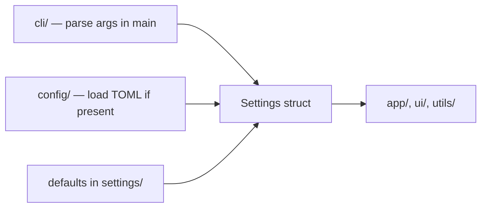

# Architecture

This document defines how Rust projects in this workspace are structured, how configuration and settings flow through binaries, and what must hold before any change is committed.

---

## 1. Principles

### 1.1 Separation of concerns

Each module owns one responsibility. Boundaries are explicit:

- **Library crates** expose domain logic, types, and APIs — no CLI parsing, no process lifecycle, no UI rendering.
- **Binary crates** wire modules together: parse invocation, resolve settings once, initialize logging, then hand off to the application layer.
- **Cross-cutting infrastructure** (logging, configuration loading, settings resolution) lives in dedicated modules — never mixed into business logic or UI code.

Do not reach across layers. A UI module must not read environment variables; a library must not parse CLI flags.

### 1.2 Slim `main`

`main.rs` is an entry point only. It may:

1. Parse CLI arguments (raw options, flags, subcommands).
2. Call the settings resolver with those CLI values.
3. Initialize logging from the resolved settings.
4. Construct and run the application (or dispatch to a subcommand handler).

Everything else — application loops, protocol handling, rendering, file I/O beyond config — belongs in separate modules (`app/`, `utils/`, domain-specific folders).

### 1.3 Directory modules with sibling tests

Every logical module lives in **its own folder** with two files:

```text
src/
  feature/
    mod.rs      # implementation
    tests.rs    # unit tests for this module
```

Tests **never** live in the same file as production code. Integration tests remain under each crate's `tests/` directory at the crate root.

### 1.4 Cargo features for slim builds

All crates must separate **logical features** into optional Cargo features whenever practical. Downstream users should be able to depend on or build a **slimmer package** by disabling defaults and enabling only what they need.

**Rules:**

- **One feature per logical capability** — e.g. `network`, `json`, `tui` — not a single catch-all `full` or `extras` bucket.
- **Heavy or niche dependencies** stay behind features with `optional = true` in `Cargo.toml`; they must not land in `[dependencies]` unless every consumer needs them.
- **`default` features** are the smallest useful subset for typical use — not “everything we ship”.
- Gate optional code at **module boundaries** with `#[cfg(feature = "...")]`; optional modules follow the same `mod.rs` + `tests.rs` layout and include feature-gated tests.
- When feature A requires feature B, express that with `feature-b = ["feature-a"]` in `Cargo.toml` so invalid combinations fail at resolve time.

**CI feature matrix (three levels):**

Workspace CI already runs build, clippy, and test jobs across all three levels on every push and pull request:

| Level | Flag | What it validates |
| ----- | ---- | ----------------- |
| Minimal | `--no-default-features` | Core compiles with no optional surface enabled |
| Default | *(none)* | Typical end-user consumption |
| Full | `--all-features` | Every optional integration compiles and tests together |

A new feature is not done until it passes **all three** levels locally (see §8). Do not merge feature-gated code that only builds under `--all-features`.

---

## 2. Repository layout

```text
workspace-root/
  Cargo.toml              # workspace members, shared metadata, workspace.dependencies
  deny.toml               # license / advisory / ban policy
  examples/               # example TOML configs, fixtures, golden files
  docs/
    ARCHITECTURE.md         # this file
  <lib-crate>/
    src/
      lib.rs
      <module>/
        mod.rs
        tests.rs
  <binary-crate>/
    src/
      main.rs             # slim entry point
      cli/                # argument definitions only
        mod.rs
        tests.rs
      config/             # TOML load + deserialize only
        mod.rs
        tests.rs
      settings/           # unified resolver (cli > config > defaults)
        mod.rs
        tests.rs
      logger/             # tracing subscriber setup
        mod.rs
        tests.rs
      app/                # application logic (no CLI, no raw config)
        mod.rs
        tests.rs
      ui/                 # userspace apps only — see §4
        mod.rs
        <element>.rs      # one UI element per file
        tests.rs
      utils/              # shared helpers that do not belong elsewhere
        mod.rs
        tests.rs
    tests/                # integration tests
```

Workspace members are declared in the root `Cargo.toml`. Shared dependency versions belong in `[workspace.dependencies]`; crates reference them with `{ workspace = true }`.

---

## 3. Settings resolution (unified resolver)

All user-facing binaries resolve configuration through a **single pipeline**. Raw CLI and config-file values must not leak past the settings boundary.

### 3.1 Precedence

Resolution order is fixed:

```text
CLI arguments  >  config file (TOML)  >  built-in defaults
```

Higher layers override lower layers field by field.

### 3.2 Flow



1. **`main`** parses CLI via `cli/` and obtains a `CliOptions` (or equivalent) struct. This is the **only** place CLI parsing happens.
2. **`config/`** loads and deserializes a TOML file when a path is provided or a conventional location exists. It returns a `FileConfig` (or `None`). This module does not apply precedence — it only reads files.
3. **`settings/`** accepts `CliOptions` and optional `FileConfig`, merges them over defaults, and returns a single **`Settings`** object (owned, fully resolved).
4. **`logger/`** is initialized from `Settings` (log level, output target).
5. From this point forward, **only `Settings`** is passed through the call graph. No function below the resolver may accept `CliOptions`, raw `clap` types, or unparsed config paths.

CLI flags and config file paths do not survive past settings resolution.

### 3.3 Config file format

If the project uses a configuration file, it **must** be **TOML**. Place example files under `examples/`. The `config/` module owns deserialization types; `settings/` owns the merged `Settings` type consumed by the rest of the application.

---

## 4. Userspace applications (CLI / TUI / GUI)

Binaries that present an interface to the user follow additional layout rules on top of §2.

### 4.1 UI module

All UI code lives under `ui/`. Each distinct visual or interactive element gets **its own file** inside that folder:

```text
ui/
  mod.rs           # re-exports, shared UI state wiring
  header.rs
  status_bar.rs
  item_list.rs
  tests.rs
```

Rendering, event handling, and layout for a TUI (e.g. ratatui) or GUI framework belong here — not in `app/` or `main.rs`.

### 4.2 Supporting modules

| Module       | Responsibility                                              |
| ------------ | ----------------------------------------------------------- |
| `cli/`       | Argument and subcommand definitions; parsed only in `main`  |
| `config/`    | TOML discovery, read, deserialize                           |
| `settings/`  | Merge cli + config + defaults → `Settings`                  |
| `logger/`    | `tracing` subscriber init from `Settings`                   |
| `app/`       | Application state machine, domain orchestration, I/O loops  |
| `utils/`     | Pure helpers with no settings or UI dependencies            |

`app/` coordinates between domain logic and `ui/` but does not render or parse CLI.

### 4.3 CLI-only binaries

A minimal CLI without a persistent UI still uses `cli/`, `settings/`, and `logger/` when it reads config or emits structured logs. Command dispatch handlers live in `app/` or dedicated `commands/` submodules — not in `main.rs`.

---

## 5. Logging

Use the **`tracing`** ecosystem for structured logging.

- **`logger/`** initializes the subscriber once from `Settings` (level filter, optional file/stdout layers).
- Library crates emit `tracing` events; they do not configure subscribers.
- Binary crates call `logger::init(&settings)` immediately after settings resolution and before starting `app/`.
- Prefer spans for request-scoped or operation-scoped context; use fields for identifiers and counts.
- Do not use `println!` for operational diagnostics in library or application code — use `tracing` levels appropriately (`error`, `warn`, `info`, `debug`, `trace`).

---

## 6. Testing and coverage

### 6.1 Unit tests

- Co-locate unit tests in `tests.rs` next to each module's `mod.rs`.
- Test public behavior and meaningful edge cases — not implementation trivia.
- Mock external I/O at module boundaries; keep tests deterministic.

### 6.2 Integration tests

- Place cross-module and end-to-end tests in `<crate>/tests/`.
- Use temporary directories and fixtures from `examples/` where applicable.

### 6.3 Coverage expectations

The project maintains **decent test coverage** across workspace crates. CI uploads coverage reports (see `.github/workflows/test.yml`). When adding modules or behavior:

- New public API surface should have corresponding tests.
- Bug fixes should include a regression test when practical.
- Feature-gated code should be tested under the relevant feature flag in CI.

Aim for meaningful coverage of branches and error paths, not arbitrary percentage targets on boilerplate.

---

## 7. Dependencies

### 7.1 Latest versions

Use the **latest stable** releases of dependencies. Workspace crates pin versions in `[workspace.dependencies]`; individual crates reference them with `{ workspace = true }`. When adding or bumping a dependency, resolve to the current latest unless a documented incompatibility blocks it.

Dependabot is configured for weekly scans; apply updates promptly after CI passes.

### 7.2 Active crates only

Do **not** add abandoned or deprecated dependencies. A crate is acceptable only when **all** of the following hold:

- Latest release on crates.io is **within the past year**.
- Upstream repository is **not archived**.
- No outstanding RustSec advisory without a fixed upgrade path (`cargo deny check` must pass).

Justify every new dependency in the change that introduces it. Prefer std and existing workspace crates over new transitive weight.

### 7.3 Policy enforcement

- `deny.toml` — licenses, advisories, duplicate versions, registry allowlist.
- `cargo deny check` is part of the quality gate (§8).

---

## 8. Quality gates — required before every commit

**All** checks below must pass locally before committing. Do not push commits that fail any gate.

| Check | Command |
| ----- | ------- |
| Formatting | `cargo fmt --all -- --check` |
| Spelling | `typos` |
| Licenses / advisories | `cargo deny check` |
| Clippy (no default features) | `cargo clippy --workspace --all-targets --no-default-features -- -D warnings` |
| Clippy (default features) | `cargo clippy --workspace --all-targets -- -D warnings` |
| Clippy (all features) | `cargo clippy --workspace --all-targets --all-features -- -D warnings` |
| Tests (no default features) | `cargo test --workspace --no-default-features` |
| Tests (default features) | `cargo test --workspace` |
| Tests (all features) | `cargo test --workspace --all-features` |
| Documentation | `cargo doc --workspace --no-deps` |

CI runs the same gates on push and pull request across the **three-level feature matrix** (§1.4): `--no-default-features`, default, and `--all-features`. A green local run should match a green CI run.

---

## 9. Crate boundary guidelines

When splitting a workspace into library and binary crates:

| Layer | Responsibility | Typical dependencies |
| ----- | -------------- | -------------------- |
| **Library** | Domain types, algorithms, protocol logic | `thiserror`, `tracing` (events only), serde if needed |
| **Binary** | CLI, settings, logging, app wiring, optional UI | Library crate, `clap`, `tracing-subscriber`, UI crates |

**Forbidden crossings:**

- Library crates must not depend on `clap`, UI frameworks, or subscriber initialization.
- Binary `app/` and `ui/` modules must not re-parse CLI or re-read config files.
- Tests in library crates must not require a running binary unless marked `#[ignore]` with a documented manual checklist.

---

## 10. Checklist for new work

Before opening a pull request:

- [ ] New modules use `mod.rs` + `tests.rs` in a dedicated folder.
- [ ] `main.rs` only parses CLI, resolves settings, inits logger, and starts the app.
- [ ] Only `Settings` is passed below the settings resolver.
- [ ] Config files (if any) are TOML; examples live under `examples/`.
- [ ] Logging uses `tracing`; subscriber setup is in `logger/`.
- [ ] UI elements (if any) are separate files under `ui/`.
- [ ] Optional capabilities are behind Cargo features; defaults stay minimal (§1.4).
- [ ] New features pass build, clippy, and tests at all three CI levels (`--no-default-features`, default, `--all-features`).
- [ ] Dependencies are latest, active, and justified.
- [ ] Tests cover new behavior; coverage does not regress meaningfully.
- [ ] All quality gates in §8 pass locally.
